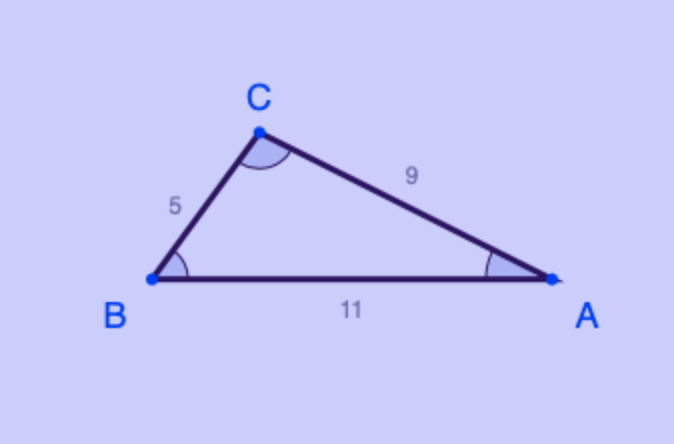

# Advanced Task 2
Given `a`, `b`, and `c`, which are the lengths of sides of a triangle, find the area of the triangle and print the results. 

  To find the area of a triangle, use 
  
<i>1/2·a·b·sin(c)</i>

