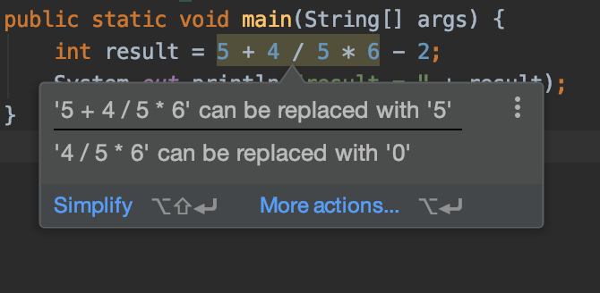

# Standard Task 3
This code is not working the way it should. The result is printing 3, however it *should* print 7.2, which is the result of:

* 5 + 4 (which equals 9), divided by
* 5, multiplied by
* 6 - 2 (which equals 4)

Do *not* change the numbers or the order of the numbers in this statement. You *must* use __order of operations__ to make this work. 

  If you see this "hint" from IntelliJ, do not follow it. It will not lead you to the correct answer.
 
 

